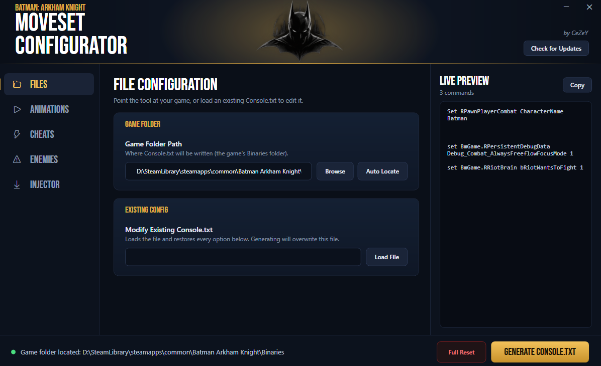
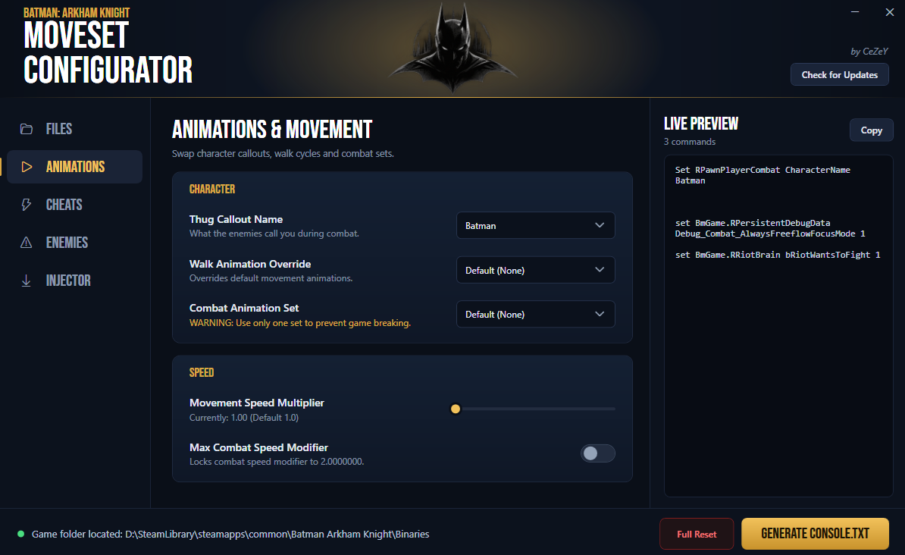
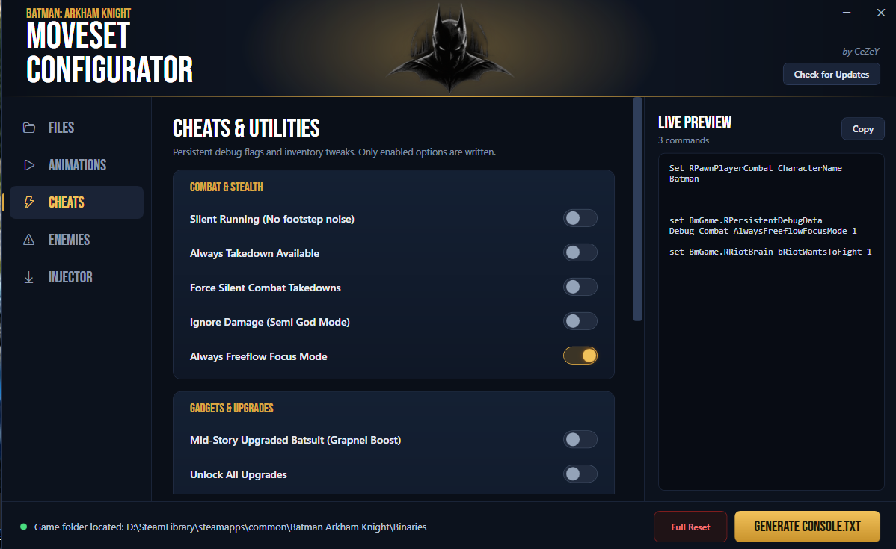
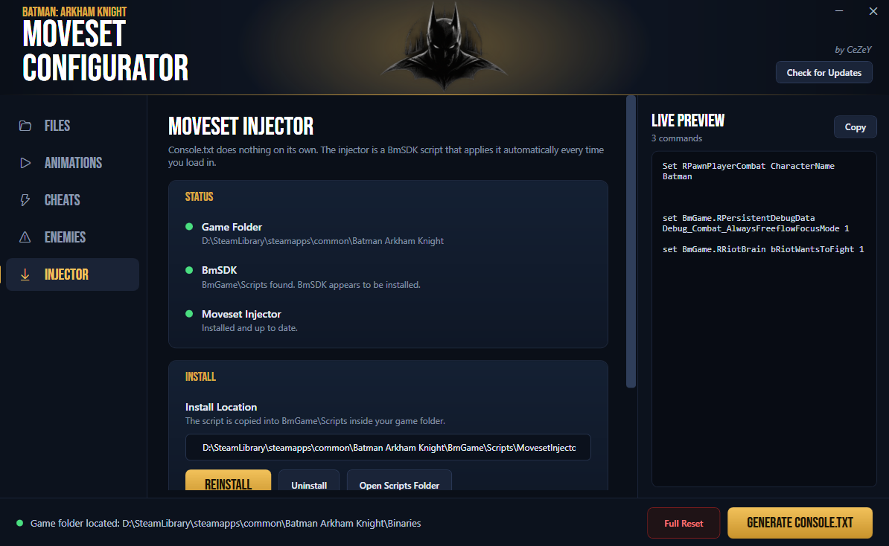

# Batman: Arkham Knight - Advanced Moveset Configurator

A modern, high-end desktop utility designed for *Batman: Arkham Knight* casual players that wants more from this game. Easily configure advanced combat movesets, tweak game settings, toggle cheats, enemies tweaks, and manage mod files seamlessly through this tool.

---

## ✨ Features
* **Categorized Tab Navigation:** Effortlessly switch between dedicated control centers:
  * **ANIMATIONS:** Override batman walk animation, change combat animation set, movement speed multiplier and max combat speed.
  * **ANIMATIONS+:** Override batman Strike animations, counter animation, auto strike lists, and etc.
  * **CHEATS:** Quickly toggle powerful gameplay modifiers and adjustments.
  * **ENEMIES:** Manage, tweak, and spawn game encounters.
  * **MOVESETS:** Basically a moveset hub which contains (for now) my own custom movesets that i made and Zaxnnn movesets which he allowed me to place into the tool, this movesets are easy to install with one click.
  * **INJECTOR:** Automatic detection for game folder, BmSDK, and the Moveset Injector, you can easily install the moveset injector through this tab, needed for Console.txt to work correctly.
* **Automatic Script Deployment:** Automatically installs the necessary `MovesetInjector` files directly into your game directory to ensure debugging and `Console.txt` functionality work right out of the box.

---

## 🚀 Installation & Setup
𝘽𝙚𝙛𝙤𝙧𝙚 𝙮𝙤𝙪 𝙗𝙚𝙜𝙞𝙣 𝙢𝙖𝙠𝙚 𝙨𝙪𝙧𝙚 𝙮𝙤𝙪 𝙝𝙖𝙫𝙚 𝙞𝙣𝙨𝙩𝙖𝙡𝙡𝙚𝙙 𝘽𝙢𝙎𝘿𝙆.
1. Download the latest setup `.exe` from the [Releases Page](../../releases).
2. Run BatmanAK Moveset Configurator Installer and install the app anywhere you like.
3. Launch `BatmanAK Moveset Configurator.exe`.
4. Point the tool to your *Batman: Arkham Knight* by pressing the Auto-Locate button.
5. Enjoy customizing your game!

---

## 📦 Requirements

* **Operating System:** Windows 10 / 11 (64-bit)
* **Game:** *Batman: Arkham Knight* (PC / Steam only)
* **Runtime:** .NET 10.0 Runtime (If the app doesn't open)
* **BmSDK:** 0.21.0

---

## 🤝 Credits & Acknowledgments

* Developed for the *Batman: Arkham Knight* modding community.
* Special thanks to creators of BmSDK and community injection tools.

---
